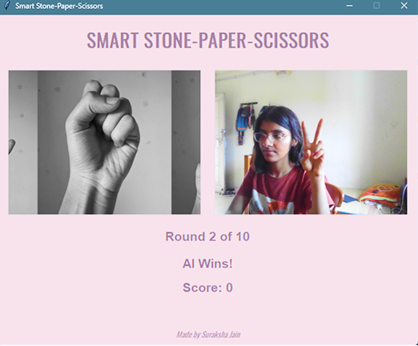

# Stone, Paper, Scissor game with mediapipe, OpenCV

[Interactive](https://img.shields.io/badge/-Interactive-%23ffbe0b)

The game uses real-time hand gesture recognition via webcam to let the user play Rock-Paper-Scissors against an AI that randomly selects its move. It detects the user’s hand gestures, compares them with the AI’s choice, and displays the outcome live on the video feed. This interactive setup showcases the integration of gesture detection and immediate visual feedback for an engaging user experience.

This is how the interface looks like.
This is how the interface looks like.

  

Requirements to run the program
1. Download all the required modules using pip install -r requirements.txt
2. To run the game script create a virtual environment in thge folder and download python 3.10.x

